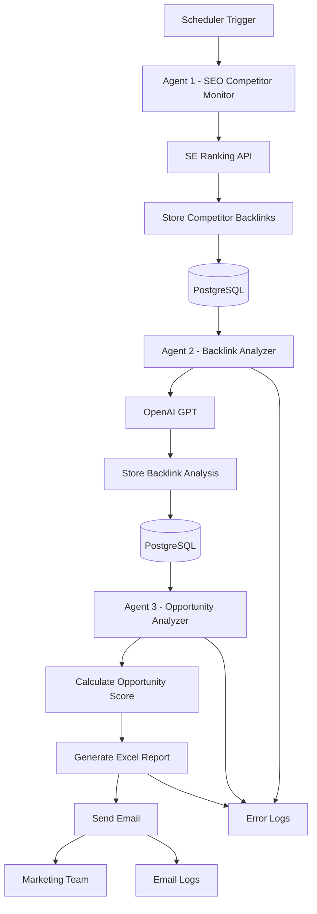
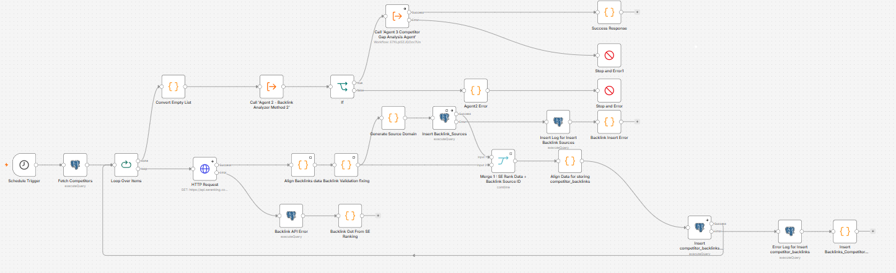
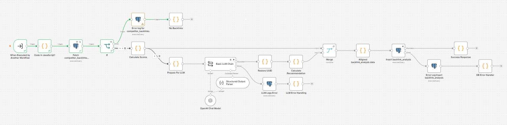
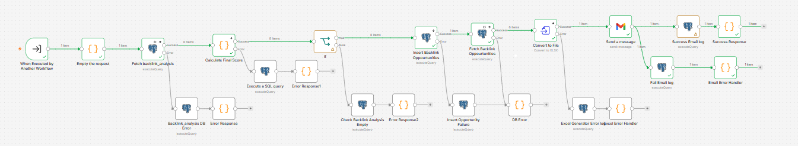

# 🚀 N8N AI SEO Agents

An end-to-end AI-powered SEO Competitor Backlink Monitoring System built using **n8n**, **PostgreSQL**, **OpenAI GPT**, and **SE Ranking API**.

This project automatically discovers competitor backlinks, evaluates their SEO value using AI, identifies high-priority backlink opportunities, and delivers a daily Excel report to the marketing team via email.

---

# 🎯 Project Objective

The objective of this project is to automate competitor backlink analysis and help marketing teams identify valuable backlink opportunities without manual SEO research.

Instead of spending hours analyzing competitor backlinks manually, this system performs the complete workflow automatically every day.

---

# ✨ Key Features

- Daily automated competitor backlink collection
- AI-powered backlink relevance analysis
- Spam score evaluation
- Opportunity score calculation
- High / Medium priority backlink identification
- Daily Excel report generation
- Automated email delivery
- Error logging
- Email logging
- Duplicate backlink detection
- PostgreSQL database integration
- Production-ready exception handling

---

# 🛠️ Technology Stack

| Category | Technology |
|----------|------------|
| Workflow Automation | n8n |
| Programming Language | JavaScript |
| Database | PostgreSQL |
| AI Model | OpenAI GPT |
| SEO Data Provider | SE Ranking API |
| Email Service | Gmail |
| Report Generation | Convert to XLSX (n8n) |
| Version Control | Git & GitHub |

---

# 🏗️ System Architecture



---

# 🔄 Workflow Overview

The solution is divided into three independent AI agents.

## 🔹 Agent 1 – SEO Competitor Monitor

Responsibilities:

- Fetch active competitors from PostgreSQL
- Retrieve competitor backlinks using the SE Ranking API
- Store unique backlink domains
- Prevent duplicate backlink entries
- Save competitor backlink information
- Trigger Agent 2 after processing all competitors

---

## 🔹 Agent 2 – Backlink Analyzer

Responsibilities:

- Fetch unanalyzed backlinks
- Analyze backlink quality using OpenAI GPT
- Calculate:
  - Relevance Score
  - Spam Score
  - Authority Score
  - Opportunity Score
- Store analysis results
- Mark backlinks as analyzed
- Trigger Agent 3

---

## 🔹 Agent 3 – Competitor Gap Analysis

Responsibilities:

- Read backlink analysis results
- Calculate backlink opportunity scores
- Classify opportunities into:
  - HIGH
  - MEDIUM
  - LOW
- Generate daily Excel reports
- Send email reports to the marketing team
- Store email logs
- Store workflow error logs

---

# 🗄️ Database Design

The project uses PostgreSQL as the primary database.

| Table | Purpose |
|--------|---------|
| competitors | Stores the list of competitor companies monitored by the system. |
| backlink_sources | Stores unique backlink source domains. |
| competitor_backlinks | Stores backlinks discovered for each competitor. |
| backlink_analysis | Stores AI-generated backlink analysis and scoring. |
| backlink_opportunities | Stores final opportunity scores and priority levels. |
| error_logs | Stores workflow execution errors for debugging and monitoring. |
| email_logs | Stores email delivery history and status. |

---

# 📁 Project Structure

```
N8N-AI-SEO-Agents
│
├── Database
│   └── schema.sql
│
├── Docs
│   ├── Architecture.md
│   ├── Database.md
│   ├── ErrorHandling.md
│   ├── Installation.md
│   └── Workflow.md
│
├── Workflows
│   ├── 01_Agent1_SEO_Competitor_Monitor.json
│   ├── 02_Agent2_Backlink_Analyzer.json
│   └── 03_Agent3_Competitor_Gap_Analysis.json
│
├── README.md
├── LICENSE
└── .gitignore
```

---

# 📸 Workflow Screenshots

## Agent 1 – SEO Competitor Monitor



---

## Agent 2 – Backlink Analyzer



---

## Agent 3 – Competitor Gap Analysis



---